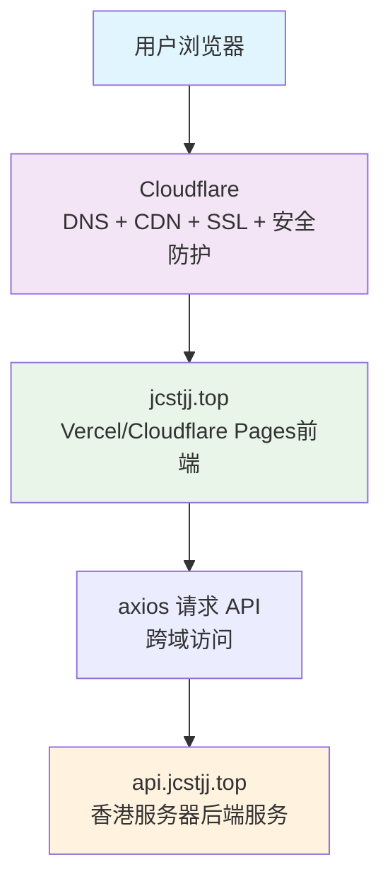

# 虚拟交易平台

一个用于模拟交易的虚拟平台，支持多种交易类型和社交功能。

## 功能特性

- 多种交易引擎（合约交易、二元期权、私募基金）
- 社交功能（关注、交易分享、点赞、评论）
- 风险管理
- 市场模拟
- 数据分析
- 工作流系统
- 响应式Web前端（基于React + Vite + Tailwind CSS）
- 移动端优化界面
- 实时市场数据更新
- 系统监控和性能分析
- 多平台部署支持（Vercel、Cloudflare Pages、传统服务器）

## 项目结构

```
project-root/
├── apps/                        # 多服务入口
│   ├── fund-server/            # 私募基金服务
│   ├── contract-market/        # 合约交易服务
│   ├── option-market/          # 期权交易服务
│   └── cron-jobs/              # 定时任务服务
│       ├── updateFundNetValue.js
│       ├── contractMarketUpdater.js
│       └── optionMarketUpdater.js
├── packages/                   # 可复用模块
│   ├── db-adapter/             # Teable Proxy 封装
│   ├── api-client/             # Axios 封装
│   ├── chart-kit/              # 图表组件封装
│   └── ui-components/          # 通用 UI 组件库
├── web/                        # 响应式 Web 前端 (React + Vite)
│   ├── src/                    # 源代码
│   │   ├── components/         # React 组件
│   │   ├── pages/              # 页面组件
│   │   ├── router/             # 路由配置
│   │   ├── App.tsx             # 根组件
│   │   └── main.tsx            # 入口文件
│   ├── index.html              # HTML 模板
│   ├── package.json            # 前端依赖配置
│   ├── vite.config.ts          # Vite 配置
│   ├── tailwind.config.js      # Tailwind CSS 配置
│   └── postcss.config.js       # PostCSS 配置
├── mobile/                     # 移动端页面（已完成组件化迁移）
│   ├── index.html              # 移动端首页
│   ├── market.html             # 移动端行情页
│   ├── trade.html              # 移动端交易页
│   └── profile.html            # 移动端个人页
├── public/                     # 静态资源
├── scripts/                    # 构建/部署脚本
├── config/                     # 配置文件
├── data/                       # 数据文件
├── k8s/                        # Kubernetes 配置
├── src/                        # 源代码
│   ├── controllers/            # 控制器
│   ├── database/               # 数据库适配器
│   ├── engine/                 # 交易引擎
│   ├── middleware/             # 中间件
│   ├── models/                 # 数据模型
│   ├── modules/                # 功能模块
│   ├── routes/                 # 路由
│   ├── utils/                  # 工具函数
│   └── app.js                 # Express 应用
├── tests/                      # 测试文件
└── templates/                  # 模板文件
```

## 系统架构

系统采用现代化的分布式架构，支持多平台部署：



### 架构组件说明

1. **前端层**：
   - Vercel托管：`jiuzhougroup.vip` - 主要前端界面
   - Cloudflare Pages：静态管理面板 - 适用于纯前端展示
   - 本地开发：`localhost:5173` - 开发环境

2. **网关层**：
   - Cloudflare：提供DNS解析、CDN加速、SSL证书和安全防护

3. **后端层**：
   - 香港服务器：`api.jcstjj.top` - 提供完整的API服务和业务逻辑

## 模块职责说明

### apps/ - 多服务入口
- **fund-server/**: 私募基金服务，提供基金相关的API和页面
- **contract-market/**: 合约交易服务，提供合约行情相关的API和页面
- **option-market/**: 期权交易服务，提供期权行情相关的API和页面
- **cron-jobs/**: 定时任务服务，包含所有定时更新任务

### packages/ - 可复用模块
- **db-adapter/**: Teable数据库连接和查询封装
- **api-client/**: Axios HTTP客户端封装，统一处理请求和响应
- **chart-kit/**: 图表组件封装，基于ECharts提供统一的图表接口
- **ui-components/**: 通用UI组件库，提供可复用的界面组件

### web/ - 响应式 Web 前端
- **src/components/**: 可复用的React组件
- **src/pages/**: 页面级React组件
- **src/router/**: React Router路由配置
- **src/App.tsx**: 根组件
- **src/main.tsx**: 应用入口文件
- **index.html**: HTML模板文件
- **package.json**: 前端依赖配置，包含React、Vite、Tailwind CSS等
- **vite.config.ts**: Vite构建工具配置
- **tailwind.config.js**: Tailwind CSS配置
- **postcss.config.js**: PostCSS配置

### mobile/ - 移动端页面
- 所有移动端页面已完成React组件化迁移
- 通过React Router实现单页应用导航
- 使用统一的UI组件库构建页面

## 快速开始

### 本地运行

```bash
# 安装依赖
npm install

# 启动服务
npm start
```

服务将在 http://localhost:3001 上运行。

### 使用 PM2 管理服务

项目包含 PM2 配置文件 `ecosystem.config.js`，用于统一管理主服务和定时任务。

```bash
# 安装 PM2
npm install pm2 -g

# 启动所有服务
pm2 start ecosystem.config.js

# 保存配置（开机自启）
pm2 save

# 设置开机自启（按提示执行生成的命令）
pm2 startup
```

#### PM2 配置说明

PM2 配置包含以下应用：

1. `fund-server` - 基金服务，提供基金Web界面和API接口 (端口: 3001)
2. `contract-market` - 合约行情服务 (端口: 3002)
3. `option-market` - 期权行情服务 (端口: 3003)
4. `fund-cron` - 基金净值更新定时任务
5. `contract-cron` - 合约市场数据更新定时任务
6. `option-cron` - 期权市场数据更新定时任务
7. `performance-alert-checker` - 性能警报检查定时任务

所有服务都会自动重启并在系统启动时自动运行。

#### PM2 常用命令

```bash
pm2 list                           # 查看所有进程状态
pm2 logs                           # 查看所有应用日志
pm2 logs fund-server              # 查看基金服务日志
pm2 logs fund-cron                # 查看基金定时任务日志
pm2 logs contract-market          # 查看合约行情服务日志
pm2 logs option-market            # 查看期权行情服务日志
pm2 restart fund-server           # 重启基金服务
pm2 stop contract-market          # 停止合约行情服务
pm2 delete option-market          # 删除期权行情服务
pm2 monit                         # 实时监控资源占用
```

### 开发模式

```bash
# 后端开发模式
npm run dev

# 前端开发模式
cd web && npm run dev
```

## 🚀 快速启动指南

### 推荐启动方式（生产环境）

```bash
# 使用PM2启动所有服务
npm run pm2-start

# 或使用启动脚本
./start.bat
```

### 开发模式

```bash
# 后端开发模式
npm run dev

# 前端开发模式
cd web && npm run dev
```

### Qoder 系统总控

支持的命令：
- "启动系统" - 使用 PM2 启动所有服务
- "停止系统" - 停止所有服务
- "重启系统" - 重启所有服务

## 🧩 Qoder 控制台集成

项目现已支持在 Qoder 控制台中一键管理服务：

### 控制台按钮映射

| 按钮名称 | 脚本或命令 |
|----------|-------------|
| 启动服务 | `bash scripts/start-project.sh` |
| 查看证书 | `bash scripts/check-cert.sh` |
| 查看日志 | `bash scripts/logs.sh` |
| 重载 Nginx | `PowerShell -ExecutionPolicy Bypass -File scripts/reload-nginx.ps1` |
| 一键诊断 | `bash scripts/diagnose.sh` |

### 功能说明

1. **一键启动服务**: 自动安装依赖并启动 Node.js 服务
2. **自动健康检查**: 通过 `/health` 接口检查服务状态
3. **Nginx HTTPS 反向代理**: 配置 SSL 证书和反向代理
4. **证书状态展示**: 显示 SSL 证书的有效期信息
5. **日志面板集成**: 实时查看应用日志输出
- "查看状态" - 查看服务状态
- "开发模式启动" - 启动开发模式

```bash
npm run qoder "启动系统"
```

### 服务访问地址

- 基金服务: http://localhost:3001
- 合约交易: http://localhost:3002
- 期权交易: http://localhost:3003
- 系统管理面板: http://localhost:3001/admin/panel
- 用户仪表板: http://localhost:3001/client/dashboard

## 系统总控面板

项目提供了 Qoder 系统总控面板，可以通过简单的中文指令执行复杂的系统任务：

```bash
# 执行系统总控任务（构建、部署、同步等）
npm run qoder "执行系统总控任务"

# 检查所有模块状态
npm run qoder "检查所有模块状态"

# 同步数据库并更新文档
npm run qoder "同步数据库并更新文档"
```

## 诊断工具

项目提供了诊断工具来检查系统状态：

### 快速诊断（Windows）
```bash
scripts\quick-diagnostics.bat
```

### 详细诊断
```bash
node scripts/system-diagnostics.js
```

## 部署

### 多平台部署支持

项目支持多种部署方式，以适应不同的使用场景：

1. **Vercel部署**：适用于现代化前端应用托管
2. **Cloudflare Pages部署**：适用于静态网站托管
3. **传统服务器部署**：适用于完整功能的本地部署

### Vercel部署

前端应用可以部署到Vercel平台：

```bash
# 部署步骤详见 web/DEPLOY-VERCEL.md
```

环境变量配置：
- `VITE_API_BASE`: https://api.jcstjj.top
- `VITE_APP_NAME`: 虚拟交易平台
- `VITE_CUSTOM_DOMAIN`: jiuzhougroup.vip

### Cloudflare Pages部署

管理面板可以部署到Cloudflare Pages：

```bash
# 部署步骤详见 DEPLOY-CLOUDFLARE.md
```

### Docker 部署

项目支持 Docker 部署，使用以下命令构建和运行：

```bash
# 构建镜像
docker build -t virtual-trading-platform .

# 运行容器
docker run -p 3000:3000 virtual-trading-platform
```

### Kubernetes 部署

项目包含完整的 Kubernetes 配置文件，位于 [k8s](k8s/) 目录中。

### Nginx 反向代理配置

项目包含 Nginx 配置文件，支持多服务反向代理：

```nginx
# 基金服务代理
location / {
    proxy_pass http://localhost:3001;  # 后端应用
}

# API服务代理
location /api/ {
    proxy_pass http://localhost:3001/;
}
```

### Nginx HTTPS 配置

项目支持通过 Nginx 配置 HTTPS，包含以下特性：

1. HTTP 自动重定向到 HTTPS
2. SSL 证书配置支持
3. 多域名支持 (jcstjj.top 和 www.jcstjj.top)

相关配置文件：
- `config/nginx/nginx/jcstjj.top.conf` - 域名配置文件
- `scripts/nginx-deploy-and-start.bat` - Nginx 部署和启动脚本
- `scripts/one-click-deploy.bat` - 一键部署脚本 (包括 SSL 证书申请)
- `scripts/nginx-deploy-and-start.bat` - Nginx 部署和启动脚本
- `scripts/nginx-manager.bat` - Nginx 管理脚本

### 自动化部署

项目包含自动化部署脚本：

```bash
# Linux/Mac
./scripts/deploy.sh

# Windows
scripts\deploy.bat
```

## 文档

- [版本变更日志](CHANGELOG.md)
- [部署指南](docs/deployment/DEPLOYMENT.md)
- [API 文档](docs/api/API.md)
- [用户使用指南](docs/guides/USER_GUIDE.md)
- [v1.0 版本发布说明](docs/RELEASE_v1.0.md)
- [系统架构说明](docs/architecture.md)
- [部署清单](DEPLOYMENT-CHECKLIST.md)
- [Vercel部署指南](web/DEPLOY-VERCEL.md)
- [Cloudflare部署指南](DEPLOY-CLOUDFLARE.md)
- [服务器部署指南](SERVER-DEPLOYMENT.md)

## 测试

项目包含多种测试文件：

- **单元测试**: 位于 `tests/unit/` 目录，使用 Jest 框架
- **集成测试**: 位于 `tests/integration/` 目录
- **移动端测试**: 位于 `tests/` 目录下以 `mobile-` 开头的文件
- **功能测试**: 位于 `tests/` 目录下以 `test-` 开头的文件

运行测试：

```bash
# 运行所有测试
npm test

# 运行单元测试
npm run test:unit

# 运行移动端测试
npm run test:mobile
```

## 许可证

MIT