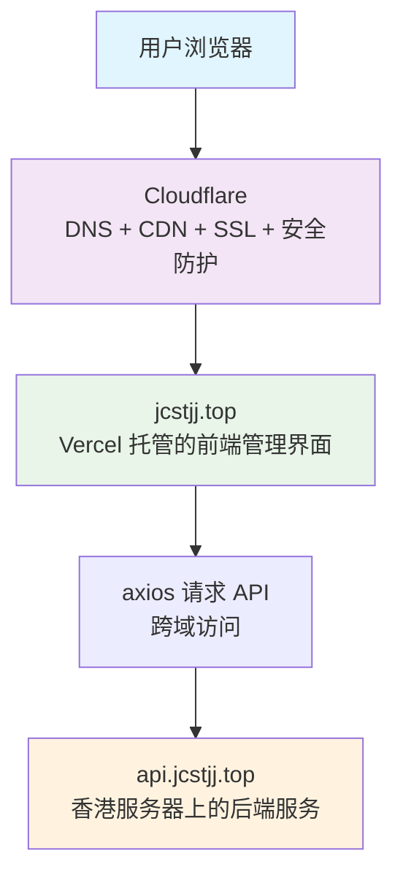

# 系统架构总览

## 三层联动架构



## 各部分职责详解

### 1. Vercel（前端管理界面）

- 托管 React 项目（管理面板）
- 自动构建 + 部署
- 使用环境变量连接后端 API：
  ```env
  VITE_API_BASE=https://api.jcstjj.top
  ```

### 2. 香港服务器（后端服务）

- Node.js + Express + PM2
- 提供接口 `/ops/run-script`、`/trade/status` 等
- Nginx 监听 443，代理接口
- 开启 CORS，允许前端跨域访问

### 3. Cloudflare（统一入口 + 安全加速）

- DNS：将 `jcstjj.top` 指向 Vercel，`api.jcstjj.top` 指向香港服务器
- SSL：提供 HTTPS 加密（建议 Full Strict 模式）
- CDN：加速前端资源加载
- WAF：防护恶意请求、DDoS 攻击
- Proxy：隐藏真实服务器 IP

## 前端跨域连接后端

在 React 项目中：

```js
axios.post(`${import.meta.env.VITE_API_BASE}/ops/run-script`, {
  script: 'auto-fix'
})
```

后端 CORS 配置：

```js
app.use(require('cors')({
  origin: 'https://jcstjj.top',
  methods: ['GET', 'POST'],
}));
```

## 安全建议

- 所有接口加上 Token 校验或 IP 白名单
- Cloudflare 开启 Rate Limiting 和 Bot 管理
- 后端日志记录所有请求来源与执行结果