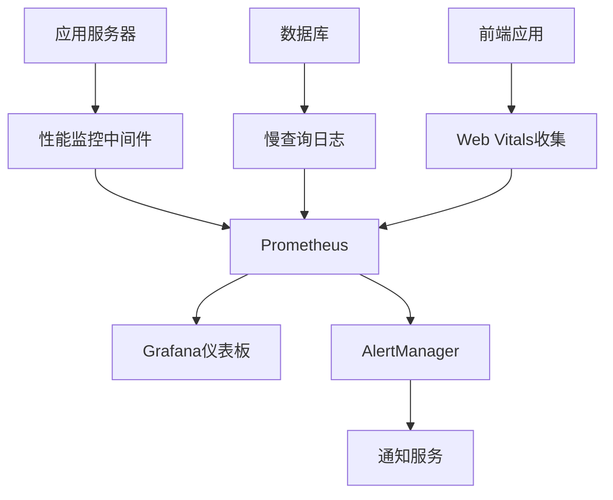

# 性能监控系统架构设计

## 1. 系统概述

本性能监控系统旨在全面监控虚拟交易平台的各项关键性能指标，包括API响应时间、数据库查询性能、前端页面加载速度等，确保系统稳定高效运行。

## 2. 技术选型

### 2.1 后端监控
- **Express Middleware**: 自定义中间件收集API请求响应时间
- **Prometheus**: 作为核心监控指标收集和存储系统
- **Grafana**: 用于可视化监控数据和创建仪表板
- **Winston**: 用于日志记录和分析

### 2.2 数据库监控
- **MySQL Performance Schema**: 监控数据库查询性能
- **慢查询日志分析**: 识别性能瓶颈

### 2.3 前端监控
- **Web Vitals**: 监控核心Web性能指标
- **Performance API**: 收集页面加载性能数据

### 2.4 告警机制
- **AlertManager**: 与Prometheus集成的告警管理器
- **邮件/SMS通知**: 多渠道告警通知

## 3. 架构图

## 4. 监控指标

### 4.1 API监控
- 请求响应时间
- 请求成功率
- 吞吐量(QPS)
- 错误率

### 4.2 数据库监控
- 查询响应时间
- 连接数
- 慢查询数量
- 缓冲池命中率

### 4.3 前端监控
- 页面加载时间
- 首次内容绘制时间(FCP)
- 最大内容绘制时间(LCP)
- 累积布局偏移(CLS)

## 5. 部署架构

### 5.1 监控组件
- Prometheus Server: 运行在3010端口
- Grafana: 运行在3011端口
- AlertManager: 运行在3012端口

### 5.2 应用集成
- 在每个应用服务中集成监控中间件
- 通过Exporter暴露监控指标

## 6. 实施计划

1. 搭建Prometheus + Grafana监控平台
2. 开发API性能监控中间件
3. 实现数据库性能监控
4. 集成前端性能监控
5. 配置告警规则
6. 创建监控仪表板
7. 编写使用文档